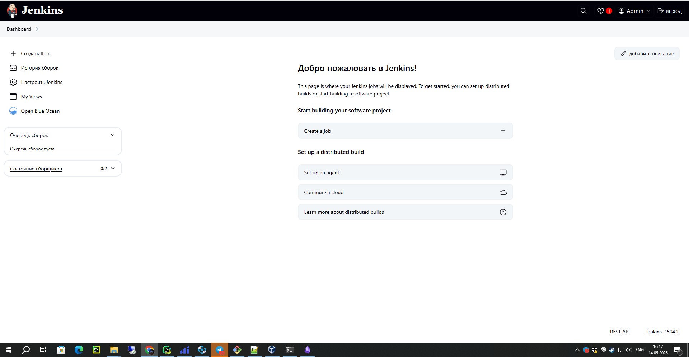
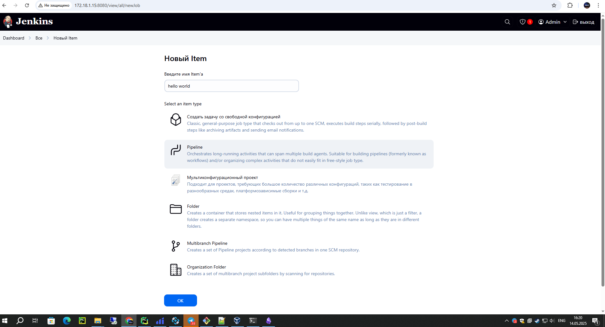
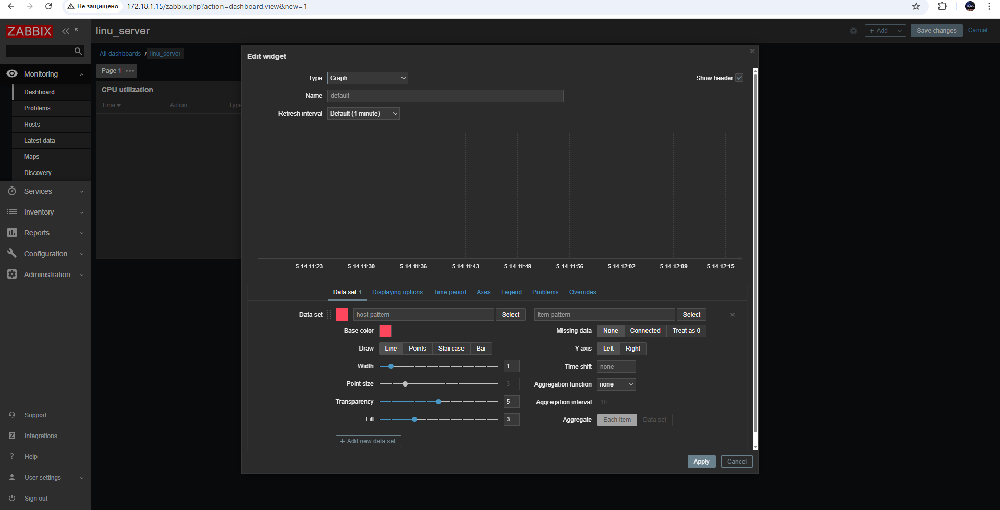
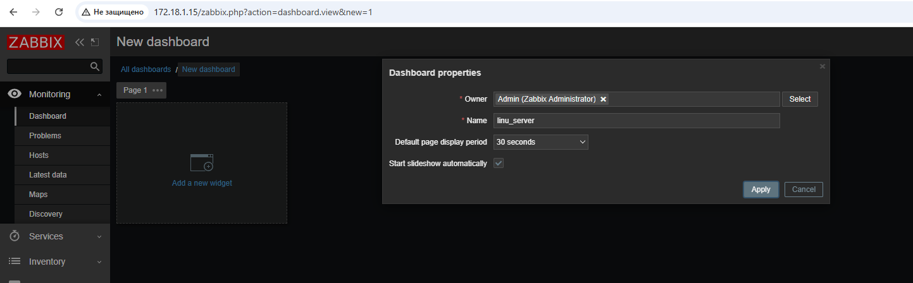
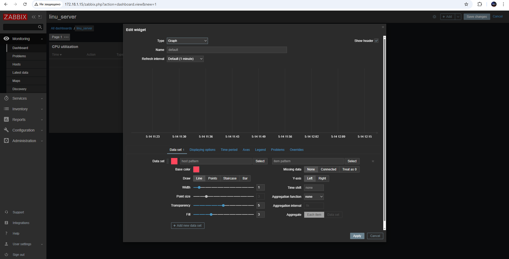
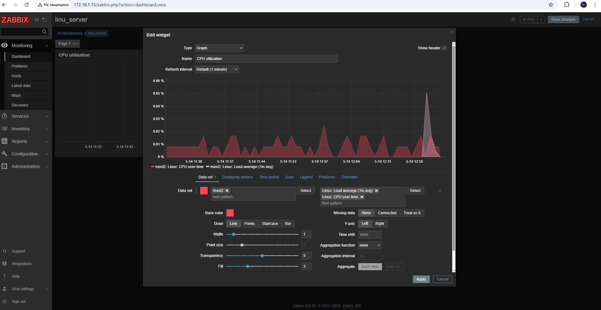
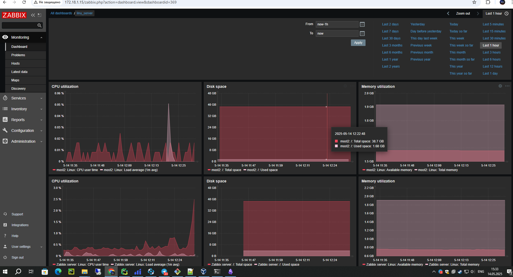

# Инструкция по запуску проекта 

## 1. Установка необходимого ПО

### Для Windows:

1. Установите **VirtualBox**:  
    [Скачать с официального сайта](https://www.virtualbox.org/wiki/Downloads)
    
2. Установите **Vagrant**:  
	[Скачать с официального сайта](https://www.vagrantup.com/downloads)

	- Запустите скачанный `.exe` файл
	- Следуйте инструкциям установщика
	- Перезагрузите компьютер


### 1.2 Проверка установки

``` bash
vagrant --version
```

## 2 Создание ВМ

1. Перейдите в папку проекта:
2. Инициализируйте Vagrant:
``` bash
  vagrant init	
```
### 2.1 Настройка конфигурации

1. Замените содержимое `Vagrantfile`на:
	- vagrant/Vagrantfile
### 2.2 Запуск виртуальных машин

``` bash
  vagrant up
```
_После выполнения vagrant up у вас будут созданы 2 виртуальные машины `название машин most1 и most2`._

_Доступ к веб-интерфейсам после развертывания:_
- Zabbix-server
   - Адрес: http://<Ваш_IP_сервера> или http://localhost:80
   - Данные для входа:
     - Логин: Admin 
     - Пароль: zabbix


 - Jenkins
   - Адрес: http://<Ваш_IP_сервера>:8080
     
_Так как Jenkins запущен в Docker, выполните следующие команды:_
1. Подключитесь к виртуальной машине:
```bash
vagrant ssh most1
```

2. Найдите ID контейнера Jenkins:
```bash
sudo docker ps
```
3. Зайдите в контейнер:

```bash
sudo docker exec -it <ID_контейнера> bash
```
4. Просмотрите первоначальный пароль:
```bash
cat /var/jenkins_home/secrets/initialAdminPassword
```
- Подключение к машинам 

``` bash
vagrant ssh most1
```

``` bash
vagrant ssh most2
```

### 2.3 Работа с виртуальной машиной
- Подключиться по SSH:
  ``` bash
  vagrant ssh
  ```
- Приостановить работу:
    ``` bash
  vagrant suspend
    ```
- Полная остановка:
    ``` bash
  vagrant halt
    ```
- Удалить машину:
    
    ``` bash
  vagrant destroy
    ```

### 2.4 Перезагрузка конфигурации

После изменения Vagrantfile:
```
vagrant reload
```

#### Советы

1. При проблемах с запуском проверьте:
    
    - Включена ли виртуализация в BIOS
        
    - Достаточно ли свободного места на диске
        
    - Логи ошибок: `vagrant up --debug`
        
2. Для ускорения работы:
    
    - Используйте локальные образы (boxes)
        
        
3. Полезные команды:
    
    
    `vagrant status`    # Показать статус ВМ
   
    `vagrant port`      # Показать проброшенные порты
   
    `vagrant snapshot`  # Работа со снимками состояния

## 3 Создать проект уровня "hello world" на скриптоввом языке
Для реализации жтого проетка был выбран скриптовый язык такой как `bash`
``` bash
#!/bin/bash
Greetings="Hello, World!"
echo $Greetings
```

## 4 CI-часть:
### Для реализация удалённой сборки проекта (из п. №2) с помощью CI-pipeline был использован jenkins 
- Требования
	- Установленный и настроенный сервер Jenkins 
      - как устанвоить Jenkins можно посмотерть в репозитории устанвока [Jenkins](https://github.com/killerspeed/most_task/tree/version/jenkins)
 	- Доступ к репозиторию с исходным кодом проекта
- Настройка Jenkins
	- Установите необходимые плагины в Jenkins:
 		- Pipeline
   		-  Git

    



### Для создание Pipeline нажимаем создание item:
- Выберите тип "Pipeline"
- Укажите название вашего проекта



### Настройка SCM (Git)
- В разделе "Pipeline" выберите:
	- Definition: Pipeline script from SCM
 	- SCM: Git
- Укажите Repository URL, например:
```
Ваша ссылка на репозиторий
```
- Если требуется аутентификация, добавьте Credentials (логин и пароль или токен).


 
### Настройка веток для сборки
- В разделе "Branches to build" укажите:
	-  Branch Specifier: Оставьте пустым для сборки любой ветки или укажите конкретную, например main.
###  Указание пути к Jenkinsfile
- В поле "Script Path" укажите путь к файлу конфигурации, например:
  ```
  jenkins/Jenkinsfile  
  ```


### тестирование 

Для теста нажимапем `собрать сейчас
`


```
Started by user admin
Obtained jenkins/Jenkinsfile from git https://github.com/killerspeed/most_task/
[Pipeline] Start of Pipeline
[Pipeline] node
Running on Jenkins in /var/lib/jenkins/workspace/Hello world
[Pipeline] {
[Pipeline] stage
[Pipeline] { (Declarative: Checkout SCM)
[Pipeline] checkout
Selected Git installation does not exist. Using Default
The recommended git tool is: NONE
No credentials specified
Cloning the remote Git repository
Cloning repository https://github.com/killerspeed/most_task/
 > git init /var/lib/jenkins/workspace/Hello world # timeout=10
Fetching upstream changes from https://github.com/killerspeed/most_task/
 > git --version # timeout=10
 > git --version # 'git version 2.34.1'
Setting http proxy: srvproxy.power.rb:8080
 > git fetch --tags --force --progress -- https://github.com/killerspeed/most_task/ +refs/heads/*:refs/remotes/origin/* # timeout=10
 > git config remote.origin.url https://github.com/killerspeed/most_task/ # timeout=10
 > git config --add remote.origin.fetch +refs/heads/*:refs/remotes/origin/* # timeout=10
Avoid second fetch
 > git rev-parse refs/remotes/origin/version^{commit} # timeout=10
Checking out Revision bb098e39a120ddd4041817e4ec97a92a3aa1eada (refs/remotes/origin/version)
 > git config core.sparsecheckout # timeout=10
 > git checkout -f bb098e39a120ddd4041817e4ec97a92a3aa1eada # timeout=10
Commit message: "docs to v1.3"
First time build. Skipping changelog.
[Pipeline] }
[Pipeline] // stage
[Pipeline] withEnv
[Pipeline] {
[Pipeline] stage
[Pipeline] { (Checkout)
[Pipeline] git
Selected Git installation does not exist. Using Default
The recommended git tool is: NONE
No credentials specified
 > git rev-parse --resolve-git-dir /var/lib/jenkins/workspace/Hello world/.git # timeout=10
Fetching changes from the remote Git repository
 > git config remote.origin.url https://github.com/killerspeed/most_task.git # timeout=10
Fetching upstream changes from https://github.com/killerspeed/most_task.git
 > git --version # timeout=10
 > git --version # 'git version 2.34.1'
Setting http proxy: srvproxy.power.rb:8080
 > git fetch --tags --force --progress -- https://github.com/killerspeed/most_task.git +refs/heads/*:refs/remotes/origin/* # timeout=10
 > git rev-parse refs/remotes/origin/main^{commit} # timeout=10
Checking out Revision 2868afb63f460fbcda5c6add2d566bbfa86c0efb (refs/remotes/origin/main)
 > git config core.sparsecheckout # timeout=10
 > git checkout -f 2868afb63f460fbcda5c6add2d566bbfa86c0efb # timeout=10
 > git branch -a -v --no-abbrev # timeout=10
 > git checkout -b main 2868afb63f460fbcda5c6add2d566bbfa86c0efb # timeout=10
Commit message: "Delete .github/workflows/main.yml"
First time build. Skipping changelog.
[Pipeline] }
[Pipeline] // stage
[Pipeline] stage
[Pipeline] { (Set Permissions)
[Pipeline] sh
+ chmod +x hello.sh
[Pipeline] sh
+ ls -la hello.sh
-rwxr-xr-x 1 jenkins jenkins 81 May 15 18:44 hello.sh
[Pipeline] }
[Pipeline] // stage
[Pipeline] stage
[Pipeline] { (Run Script)
[Pipeline] sh
+ ./hello.sh
Hello,
[Pipeline] }
[Pipeline] // stage
[Pipeline] stage
[Pipeline] { (Save Artifact)
[Pipeline] sh
+ ./hello.sh
[Pipeline] archiveArtifacts
Archiving artifacts
[Pipeline] sh
+ mkdir -p /tmp/ci_artifacts
+ cp output.txt /tmp/ci_artifacts/
[Pipeline] }
[Pipeline] // stage
[Pipeline] }
[Pipeline] // withEnv
[Pipeline] }
[Pipeline] // node
[Pipeline] End of Pipeline
Finished: SUCCESS
```

Поменялся вывод

- Контекст: 
	- Отображает изменения в файле hello.sh в рамках выполнения Jenkins Pipeline.
- Назначение:
	- Показывает историю изменений в репозитории, связанных с последней сборкой, что полезно для отслеживания модификаций кода.

```
Started by user admin
Replayed #4
[Pipeline] Start of Pipeline
[Pipeline] node
Running on Jenkins in /var/lib/jenkins/workspace/Hello world
[Pipeline] {
[Pipeline] stage
[Pipeline] { (Declarative: Checkout SCM)
[Pipeline] checkout
Selected Git installation does not exist. Using Default
The recommended git tool is: NONE
No credentials specified
 > git rev-parse --resolve-git-dir /var/lib/jenkins/workspace/Hello world/.git # timeout=10
Fetching changes from the remote Git repository
 > git config remote.origin.url https://github.com/killerspeed/most_task/ # timeout=10
Fetching upstream changes from https://github.com/killerspeed/most_task/
 > git --version # timeout=10
 > git --version # 'git version 2.34.1'
Setting http proxy: srvproxy.power.rb:8080
 > git fetch --tags --force --progress -- https://github.com/killerspeed/most_task/ +refs/heads/*:refs/remotes/origin/* # timeout=10
 > git rev-parse refs/remotes/origin/version^{commit} # timeout=10
Checking out Revision b5a4f96a65f8b0b0472a35c437d8c06a32f71ed5 (refs/remotes/origin/version)
 > git config core.sparsecheckout # timeout=10
 > git checkout -f b5a4f96a65f8b0b0472a35c437d8c06a32f71ed5 # timeout=10
Commit message: "Update hello.sh"
 > git rev-list --no-walk b5a4f96a65f8b0b0472a35c437d8c06a32f71ed5 # timeout=10
[Pipeline] }
[Pipeline] // stage
[Pipeline] withEnv
[Pipeline] {
[Pipeline] stage
[Pipeline] { (Checkout)
[Pipeline] git
Selected Git installation does not exist. Using Default
The recommended git tool is: NONE
No credentials specified
 > git rev-parse --resolve-git-dir /var/lib/jenkins/workspace/Hello world/.git # timeout=10
Fetching changes from the remote Git repository
 > git config remote.origin.url https://github.com/killerspeed/most_task.git # timeout=10
Fetching upstream changes from https://github.com/killerspeed/most_task.git
 > git --version # timeout=10
 > git --version # 'git version 2.34.1'
Setting http proxy: srvproxy.power.rb:8080
 > git fetch --tags --force --progress -- https://github.com/killerspeed/most_task.git +refs/heads/*:refs/remotes/origin/* # timeout=10
 > git rev-parse refs/remotes/origin/version^{commit} # timeout=10
Checking out Revision b5a4f96a65f8b0b0472a35c437d8c06a32f71ed5 (refs/remotes/origin/version)
 > git config core.sparsecheckout # timeout=10
 > git checkout -f b5a4f96a65f8b0b0472a35c437d8c06a32f71ed5 # timeout=10
 > git branch -a -v --no-abbrev # timeout=10
 > git branch -D version # timeout=10
 > git checkout -b version b5a4f96a65f8b0b0472a35c437d8c06a32f71ed5 # timeout=10
Commit message: "Update hello.sh"
[Pipeline] }
[Pipeline] // stage
[Pipeline] stage
[Pipeline] { (Set Permissions)
[Pipeline] sh
+ chmod +x hello.sh
[Pipeline] sh
+ ls -la hello.sh
-rwxr-xr-x 1 jenkins jenkins 52 May 15 22:21 hello.sh
[Pipeline] }
[Pipeline] // stage
[Pipeline] stage
[Pipeline] { (Run Script)
[Pipeline] sh
+ ./hello.sh
Hello, Most # Поменялся вывод
[Pipeline] }
[Pipeline] // stage
[Pipeline] stage
[Pipeline] { (Save Artifact)
[Pipeline] sh
+ ./hello.sh
[Pipeline] archiveArtifacts
Archiving artifacts
[Pipeline] sh
+ mkdir -p /tmp/ci_artifacts
+ cp output.txt /tmp/ci_artifacts/
[Pipeline] }
[Pipeline] // stage
[Pipeline] }
[Pipeline] // withEnv
[Pipeline] }
[Pipeline] // node
[Pipeline] End of Pipeline
Finished: SUCCESS

```
- Слева внизу будут отоброжаться история выполнения сборок


## 5 CD-часть:

## 6 Zabbix:
### Установка и настройка Zabbix
*Установите Zabbix, следуя инструкции из репозитория:*
https://github.com/killerspeed/most_task/blob/version/zabbix/README.md

_Доступ к веб-интерфейсу:_
- После установки откройте веб-интерфейс Zabbix в браузере:
- Адрес: http://<IP_вашего_сервера> или http://localhost:80
- 
#### Добавление нового хоста в Zabbix

*Добавление второй машины для мониторинга:*
 - Перейдите в раздел Configuration → Hosts. 
 - Нажмите Create Host и заполните необходимые параметры.
_После нажатия Create Host откроется форма настройки хоста. Заполните следующие поля:_
- host name - задать имя хоста 
- Templates - Выберите подходящие шаблон 
- Groups - Назначьте хост в группу (например, Linux Servers)
- Interfaces type agent - Нажмите Add и укажите:
  - IP-адрес сервера.
  - Порт (по умолчанию 10050 для Zabbix Agent).


#### Завершение настройки хоста в Zabbix

1. Сохранение настроек
   - Нажмите кнопку Update для применения изменений.
2. Проверка подключения 
   - Если вы использовали мой Vagrantfile:
     - Хост должен отображаться в списке с зелёным индикатором (успешное подключение).


3. Ручная установка Zabbix Agent (если использовали свой сервер)
```bash
# Обновление системы
sudo apt update && sudo apt upgrade -y
sudo apt dist-upgrade -y
sudo apt autoremove -y

# Установка репозитория Zabbix
wget https://repo.zabbix.com/zabbix/6.0/ubuntu/pool/main/z/zabbix-release/zabbix-release_6.0-4+ubuntu$(lsb_release -rs)_all.deb
sudo dpkg -i zabbix-release_6.0-4+ubuntu$(lsb_release -rs)_all.deb
sudo apt update

# Установка и настройка Zabbix Agent
sudo apt install zabbix-agent -y

# Конфигурация агента
sudo sed -i 's/^ServerActive=127.0.0.1.*/ServerActive=IP_ZABBIX_SERVER/' /etc/zabbix/zabbix_agentd.conf
sudo sed -i 's/^Server=127.0.0.1.*/Server=IP_ZABBIX_SERVER/' /etc/zabbix/zabbix_agentd.conf
sudo sed -i 's/^Hostname=Zabbix server.*/Hostname=ИМЯ_ХОСТА_ИЗ_ZABBIX/' /etc/zabbix/zabbix_agentd.conf

# Перезапуск агента
sudo systemctl restart zabbix-agent.service
```


## Важные замечания
- Замените IP_ZABBIX_SERVER на IP-адрес вашего Zabbix-сервера.
- Укажите ИМЯ_ХОСТА_ИЗ_ZABBIX — имя, которое вы задали при создании хоста (поле Host name).

#### После добавления хоста и успешного подключения агента можно настроить отображение метрик на Dashboard.

1. Переход в Dashboard 
- В веб-интерфейсе Zabbix перейдите в раздел: `Monitoring` → `Dashboard` → `All dashboards`

2. Добавление виджетов
- Нажмите `Edit dashboard` (или `Create dashboard`, если он ещё не создан).


3. Настройка графика
Выберите `Graph` → `Add`.

_Укажите:_
- Название (например, "`CPU utilization`").
- `type` `Graph`



_Далее укажем имя хоста в нашем случае `most2` и метрики `Linux: CPU user time` `Linux: Load average (1m avg)
`_



все тоже самое делаем для мониторинга Диска и Памяти и так же для второй машины

4. Готовый дашборд
После добавления всех нужных виджетов:

*Нажмите Save dashboard.*




