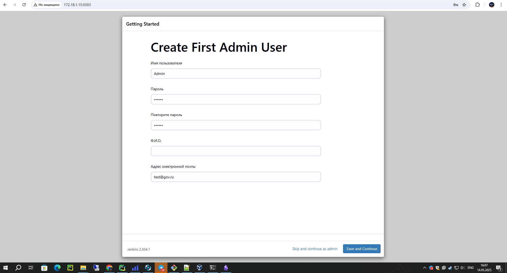

# Установка Docker и Jenkins в Docker-контейнере


###  Установка Docker 

- _Обновляем пакеты и устанавливаем зависимости:_

``` bash
sudo apt install apt-transport-https ca-certificates curl software-properties-common 
```
- _Добавляем официальный GPG-ключ Docker:_
``` bash
curl -fsSL https://download.docker.com/linux/ubuntu/gpg | sudo apt-key add - 
```
- _Добавляем репозиторий Docker:_

``` bash
sudo add-apt-repository "deb [arch=amd64] https://download.docker.com/linux/ubuntu bionic stable"
```

- _Обновляем пакеты и устанавливаем Docker CE:_
```bash
sudo apt update 
```
```bash
sudo apt install docker-ce -y 
```

- _Запускаем службу Docker:_

```bash
sudo systemctl start docker
```

###  Установка jenkins-Docker 

```bash
sudo docker network create jenkins
```
Запускаем Docker-in-Docker контейнер:
				
```
                        sudo docker run \
						--name jenkins-docker \
						--rm \
						--detach \
						--privileged \
						--network jenkins \
						--network-alias docker \
						--env DOCKER_TLS_CERTDIR=/certs \
						--volume jenkins-docker-certs:/certs/client \
						--volume jenkins-data:/var/jenkins_home \
						--publish 2376:2376 \
						docker:dind \
						--storage-driver overlay2
```

Собираем образ Jenkins с Blue Ocean:
``` bash
cd jenkins/
```
```bash
docker build -t myjenkins-blueocean:2.504.1-1 
```
Запускаем контейнер Jenkins:
```
docker run \
  --name jenkins-blueocean \
  --restart=on-failure \
  --detach \
  --network jenkins \
  --env DOCKER_HOST=tcp://docker:2376 \
  --env DOCKER_CERT_PATH=/certs/client \
  --env DOCKER_TLS_VERIFY=1 \
  --publish 8080:8080 \
  --publish 50000:50000 \
  --volume jenkins-data:/var/jenkins_home \
  --volume jenkins-docker-certs:/certs/client:ro \
  myjenkins-blueocean:2.504.1-1
```
_После завершения установки Jenkins будет доступен по адресу:
http://ваш_сервер:8080_

_Для получения начального пароля администратора выполните:_
```bash
docker exec -it id-контейнера 
```
```bash
cat /var/jenkins_home/secrets/initialAdminPassword
```
### Установка плагинов в Jenkins
- После ввода начального пароля администратора выберите "Install suggested plugins" для установки рекомендуемых плагинов 
- Дождитесь завершения процесса установки (прогресс отображается на экране)
- После установки вы увидите экран создания первого администратора:


#### Создание администратора
_На экране "Create First Admin User" заполните поля:_
- имя пользователя (например, admin)
- надежный пароль
- повтор пароля
- полное имя
- ваша электронная почта

_Нажмите "Save and Continue"_



#### Дополнительная настройка
_На следующем экране укажите URL вашего Jenkins-сервера (обычно http://ваш_сервер:8080)_

_Нажмите "`Save and Finish`"_

_Подтвердите настройку нажатием "`Start using Jenkins`"_